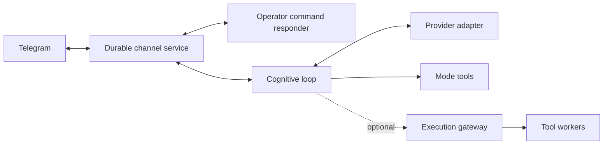

# MeTTaClaw


MeTTaClaw is an extensible agent framework written in MeTTa. It combines
cognitive loops, tool use, communication channels and persistent memory. You
can run your own instance, choose its identity and model, and extend its tools
without tying the framework to a particular bot or operator.

This fork builds on [patham9/mettaclaw](https://github.com/patham9/mettaclaw),
whose compact agent core was inspired by Nanobot. It adds CeTTa execution,
selectable Iter and Omega loops, independent channel controls, and an optional
execution gateway.

**Branch:** this guide describes `integration/upstream-modes-20260930`.
[`main`](https://github.com/godelclaw/mettaclaw/tree/main) contains the earlier
framework; use the branch in the installation command below for these modes.

[Get started](#get-started) · [Modes](#choose-a-cognitive-mode) ·
[Service setup](systemd/README.md) · [Mode internals and verification](modes/README.md) ·
[Execution gateway](src/execution_gateway/README.md)

## Choose a cognitive mode

A **mode** selects the agent's loop; a **model** selects its LLM; an **engine**
selects the MeTTa evaluator. These are independent choices.

| Mode | Behavior |
|---|---|
| `godelclaw` | The framework loop: event-armed activity, persistent lifecycle state and renewal through Iter-inspired transformations. |
| `coding` | The framework loop with a coding-oriented, high-reasoning preset. |
| `iter` | A MeTTa port of the pinned [Iter](https://github.com/patham9/iter) core, with native tool calls, transformations and autonomous renewal. |
| `omega` | The pinned [Omega](https://github.com/singnet/Omega) core, with command-text dispatch and explicit adapters for its evaluator and services. |

Use `/modes` and `/mode iter`, `/mode omega` or `/mode godelclaw` through the
configured operator channel. `/models` and `/model` manage the LLM separately;
`/engines` and `/engine` manage the evaluator. Selection persists across restarts,
and changing a mode requests a supervised restart of cognition. The menu shows
a pending selection separately from the running loop.

Iter and Omega have their own pacing, context handling and mode state. In
particular, Iter can keep renewing work without new human input; the framework's
fuel policy does not automatically impose a quota on upstream modes. Choose a
mode with the intended provider usage in mind. Switching modes preserves each
mode's files without merging its history into another mode.

See the [mode guide](modes/README.md) for upstream pins, provider differences,
compatibility aliases, conformance results and the adapter ledger.

## Get started

You need Python 3.11+, [SWI-Prolog](https://www.swi-prolog.org/) and a working
[PeTTa checkout](https://github.com/trueagi-io/PeTTa) with its Python bridge.
Install this repository's Python dependencies in the environment that bridge
uses. For CeTTa execution, also provide a built
[CeTTa](https://github.com/godelclaw/CeTTa) with `--lang petta` and its matching
`lib/` directory. The [qualified revisions](modes/README.md#pins-and-review-locations)
record the versions used for the mode checks.

### 1. Clone and initialize

```sh
git clone --branch integration/upstream-modes-20260930 \
  https://github.com/godelclaw/mettaclaw.git
cd mettaclaw
./initialize.sh
```

Initialization creates local configuration and seeds the runtime files. It does
not start an agent or register a Telegram bot.

### 2. Configure your instance

| File | What to configure |
|---|---|
| `config/local.toml` | Evaluator paths, Python environment, provider endpoint/model, channel and storage locations. Seeded from [the defaults](config/default.toml). |
| `config/secrets.env` | Provider credentials, bot token, operator IDs and allowed chats. See [the field examples](config/secrets.env.example). |
| `memory/prompt.txt` | Your agent's identity, goals and operating instructions. Review and replace the sample prompt before starting. |
| `.env` | Generated settings; regenerate with `initialize.sh` after editing `config/local.toml`. |

Set `paths.petta_root`, `paths.petta_py_env` and, if used, `paths.cetta_root` to
your installations. The default provider adapter uses an OpenAI-compatible
endpoint via `agent.synthetic_base_url`, `agent.synthetic_model` and
`SYNTHETIC_API_KEY`. The Anthropic adapter uses `ANTHROPIC_API_KEY`; its selectable
model list can be supplied through `ANTHROPIC_MODELS`.

Telegram requires your own bot token and explicit operator/chat authorization.
For its default private destination, configure
`METTACLAW_TELEGRAM_PRIMARY_CHAT_ID`. The framework also has IRC and Mattermost
adapters; the supplied Iter/Omega integration currently requires the independent
durable Telegram services described below.

Configuration, credentials, conversations and runtime state are ignored by Git.
Keep each instance's files separate. Public prompts and examples belong in the
source tree only when they are intended for reuse.

### 3. Install dependencies and check imports

After editing the configuration, regenerate it and use the configured Python
interpreter:

```sh
./initialize.sh
set -a
. ./.env
set +a
"$PETTA_PY_ENV/bin/python3" -m pip install -r requirements.txt
./run.sh smoketest.metta
```

The smoke check imports the library and exits without starting the cognitive
loop. It can fetch the `petta_lib_chromadb` dependency into `repos/` on its first
run. Embedding-backed memory needs additional configuration; see
[Memory](#memory).

### 4. Run the framework or set up supervised modes

For the default framework loop, launch from your configured checkout:

```sh
./run.sh
```

For Iter/Omega, set up the durable channel and independent command responder
first, then supervise cognition so mode changes can restart it. Follow the
[service setup guide](systemd/README.md). These channel/control services use
CeTTa even when the selected cognitive evaluator is PeTTa.

Use one checkout/configuration and one set of state directories and sockets per
instance. Names such as `research` and `assistant` are examples you choose, not
identities built into the cognitive modes. Some older named service files and
the peer-control helper are deployment-specific; the service guide distinguishes
them from the reusable templates.

## Services and execution



The durable channel owns Telegram polling, delivery and recovery. The independent
command responder handles operator settings without an LLM call, so changing a
mode or inspecting health does not wait for a cognitive turn. Message adapters
retain sender, chat, thread, reply and forwarding metadata. Group destinations
are explicit; reading a group message does not change the default send target.

CeTTa's [durable MeTTa/rho service host](https://github.com/godelclaw/CeTTa/blob/9a5355309c57d94e99e5a279e088b69cbe4486d8/docs/durable/README.md)
records inputs, proposed effects and delivery receipts at its commit boundary.
The channel clients use its CWP socket protocol. Accepting a send request is
distinct from confirming delivery; uncertain effects remain available for
reconciliation.

The optional [execution gateway](src/execution_gateway/README.md) runs tool
workers in a separate process with a SQLite queue and receipts. The current
integration exposes a small set of read tools. Provider calls and other tools
retain their own adapters; the gateway is not a universal execution path.
Its prototype transport is JSON over Unix sockets, with no native rho bridge
qualified yet. Each instance uses its own gateway configuration and queue.

Python currently supplies provider and host adapters. A native CeTTa LLM client
is future work. The separation lets a channel, a cognitive loop and a tool
worker have independent lifetimes while retaining explicit request/result
boundaries.

## Memory

The framework exposes `(remember string)` and `(query string)` for deliberate
long-term memory use. Remembered items are journaled under `memory/remembered/`;
Chroma holds the derived similarity index. The agent can use different MeTTa
representations within those memories.

Embedding-backed recall uses the configured Qwen-compatible embedding service.
The launcher defaults to `http://127.0.0.1:8876`; the service itself is not
installed by this repository. Configure `METTACLAW_EMBED_ENDPOINT` and the
matching model/protocol before using these skills. The
[journal replay utility](scripts/rebuild_chroma_from_journal.py) can build and
verify a separate Chroma index; run it with `--help` for its explicit inputs.

Upstream modes keep their own memory behavior: Iter retains its experience and
transformations; the Omega host currently provides text recall with its embedding,
NAL/PLN and plugin startup add-ons disabled. The [adapter ledger](modes/README.md#divergence-and-add-on-ledger)
details these boundaries.

## Verification and development

Small checks that use fixtures instead of a live provider:

```sh
python3 -m unittest discover -s tests -p test_loop_modes.py
python3 -m unittest discover -s tests -p test_mode_control_boundary.py
python3 -m unittest discover -s tests -p test_public_tree_audit.py
```

The [offline qualification command](modes/README.md#exact-offline-verification-command)
compares pinned upstream references with CeTTa execution, checks deliberate
semantic mutants, runs relevant upstream tests and replays observations against
Lean models. It requires the pinned evaluator and formalization checkouts.
Those models prove selected control properties with explicit host assumptions;
they do not establish correctness of every provider, tool or operating system.

To contribute, keep changes focused and include the relevant fixture or test
command. Changes to a vendored core should update its source pin, manifest and
adapter ledger together. Keep provider credentials and runtime state local.
Before publishing from an authoring clone, enable the existing audit hook:

```sh
git config core.hooksPath .githooks
python3 scripts/audit_public_tree.py --history
```

The audit checks tracked runtime paths and locally configured private values.
It complements review of the actual diff; it does not infer whether a deployment
story is appropriate public documentation.

## Illustrations

The upstream examples show memory recall, tool use and learning in a grid-world
adapted from [NACE](https://github.com/patham9/NACE).


Long-Term Memory Recall:


Tool use:


Shell output of the actual invocation of the generated MeTTa code:


System also added it into its Atom Space storage (embedding vector omitted):


## Proposal-bound self-modification

The file tools create immutable proposals instead of rewriting the running
agent. A proposal contains the exact candidate bytes, their SHA-256 digest,
the prior target digest, and provenance. MeTTa candidates are parsed by PeTTa's
`top_forms` and `sread` without calling `process_form`. Optional semantic
evaluation runs directly with the agent process's authority; it is validation,
not a sandbox, and may perform effects present in the candidate.

Promotion is a separate, explicit operation. Digest binding, stale-base checks,
and atomic replacement prevent an unverified proposal from being confused with
the promoted candidate:

```sh
python3 scripts/selfmod_supervisor.py verify PROPOSAL_ID \
  --root PROTECTED_ROOT --store PROPOSAL_STORE
python3 scripts/selfmod_supervisor.py promote PROPOSAL_ID \
  --root PROTECTED_ROOT --store PROPOSAL_STORE
```

Add `--semantic` to require direct PeTTa evaluation. Configure locations
with `METTACLAW_PROTECTED_ROOT`, `METTACLAW_SELFMOD_PROPOSAL_STORE`, and
`PETTA_ROOT`. Optional external governance is enabled only when
`METTACLAW_SELFMOD_REQUIRE_GOVERNANCE=1`; its executable is supplied through
`METTACLAW_GGB_SELFMOD_CLI`.

## Credits and license

This fork builds on [patham9/mettaclaw](https://github.com/patham9/mettaclaw).
Zar is the lead human contributor to this fork; Oruži is the collective
attribution for collaborating AI agents. The Git history retains authorship
and the progression of the work.

Iter and Omega retain their upstream licenses and exact source manifests under
[`modes/`](modes/README.md). See [LICENSE](LICENSE) for this repository's license.
