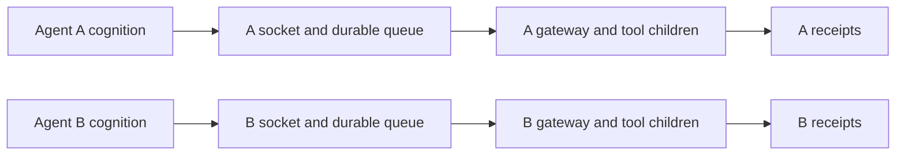

# Independent execution gateway prototype

One reusable implementation, independently configured per agent. The optional
Python/MeTTa client submits work and reads receipts; it never starts the server.
Run the gateway separately from the cognition service so their lifetimes differ.
The prototype is opt-in and does not change the agent loop or existing skills.



## Run the local demonstration

From the project root:

```sh
PYTHONPATH=src python3 examples/execution_gateway_demo.py
python3 -m unittest discover -s tests -p test_execution_gateway.py -v
```

The demo uses local test tools and two temporary gateway processes, reports
submission/status latency while a slow tool runs, and cleans up afterward.
The tests also exercise real PeTTa and CeTTa clients when those engines are
available. Configure their existing `PETTA_ROOT`, `PETTA_PY_ENV` or `CETTA_BIN`
settings if they live elsewhere.

## Configuration and requests

A gateway takes a trusted JSON config via
`PYTHONPATH=src python3 -m execution_gateway --config gateway.json`:

```json
{
  "agent": "alpha",
  "state_directory": "/tmp/gateway-alpha",
  "tools": {
    "echo": {
      "command": ["python3", "tests/fixtures/gateway_tool.py", "echo"],
      "effect": "read",
      "result_format": "json"
    }
  }
}
```

Tool commands are argv arrays, with optional `cwd`, `environment` and
`credential_files` maps. Each credential-file value is a configured filename;
its contents enter only that tool child's environment. Requests cannot choose
credential files, effect classification or another agent's destination.
Tools must not emit secrets in their outputs. The server does not inherit the
cognition process's credential environment.

```python
from execution_gateway import Client

client = Client("/tmp/gateway-alpha/gateway.sock", "alpha")
accepted = client.submit("task-17", "echo", ["one argument"], {"value": 42})
receipt = client.status("task-17")
client.cancel("task-17")
```

Each invocation passes JSON input on stdin and the argument list after the
configured command prefix. Results are either parsed JSON or captured text.
Native executables can therefore be adapters without importing them into the
cognition process. `gateway_bridge.py` provides JSON-text `submit`, `status`
and `cancel` functions for `py-call`; it binds through
`METTACLAW_GATEWAY_SOCKET` and `METTACLAW_GATEWAY_AGENT`.

Wire protocol: one newline-terminated JSON frame per connection, version 1,
with an agent identifier and operation. Submissions carry `id`, `tool`,
`arguments`, `input` and an absolute deadline. The first accepted deadline
remains fixed; a duplicate submission cannot extend it. Message framing is
bounded at 1 MiB and captured tool output at 128 KiB.

## Failure and retry semantics

| State | Meaning |
|---|---|
| `queued` | Intent committed; no dispatch attempt yet. |
| `running` | Dispatch attempt committed before process launch. |
| `succeeded` | Adapter exited successfully and its result was committed. |
| `failed` | A read attempt failed, or launch/configuration failed before execution. |
| `cancelled` | Queued work was withheld, or a running read was interrupted. |
| `expired` | Deadline passed before dispatch; no tool was launched. |
| `uncertain` | A started write lost a trustworthy completion receipt. |

The tool's configured effect is an authority assertion, not inferred from an
HTTP method or a model-provided field. Success witnesses the adapter's result,
not an independent proof of a remote effect.

SQLite commits intent, attempt and terminal transitions. Receipts are append-only.
Same-ID submissions with identical intent return the existing record, including
after restart; conflicting intent or tool configuration is rejected. The
gateway does not automatically retry an attempt. This bounds gateway dispatches
per stored ID, not retries hidden inside an adapter or an HTTP library.

A crashed gateway recovers started writes as `uncertain` and reads as `failed`.
Cancellation or timeout of a started write also remains uncertain. Inspect or
reconcile the external effect before deliberately making a new request ID.
Receipt-recording failure stops dispatch instead of leaving a silently dead
execution thread. The queue survives for conservative recovery.

## Prototype boundaries

- Per-agent queues/credentials are logical routing boundaries. Processes using
  the same Unix UID can access each other's files; this is not an OS sandbox.
- Each gateway executes one tool at a time. Other agent gateways and its own
  submission/status endpoint remain independent while that tool runs.
- The demo launches independent processes. A deployment must place the gateway
  outside the cognition service's systemd control group to survive its stop.
- Killing a gateway with SIGKILL can leave an already-started tool child running.
  Its effect is therefore uncertain; no claim of remote cancellation is made.
- There is no social adapter, provider adapter, automatic reconciliation
  or completion-event delivery yet.
- Queued requests carry a trusted tool-configuration fingerprint and do not run
  if the tool's binding changed while they were waiting.
- Plain clients poll by request ID. Rho can use the same request/receipt envelope;
  no native rho transport bridge has been qualified in this prototype.

## Read-only live pilot

The agent's skill catalog includes `gateway-tools`, `gateway-start`,
`gateway-status` and `gateway-cancel`. The start skill takes a stable request
ID, a configured tool name and a JSON object string; `_quote_` is decoded to
JSON quotation marks. It submits with a 30-second deadline and does not wait
for the tool to finish. Inspect the receipt on a later turn.

`execution_gateway.read_tools` adapts `project-status`, `vitals`, `read-lines`,
`ls-tree` and `grep-files`. These reuse bounded file observations and expose
no shell or network sender. Relative paths resolve in the configured agent
checkout. Tools retain their domain-level failure messages inside results;
gateway `succeeded` means the adapter completed, not that a requested file
necessarily existed.

The optional `systemd/pettaclaw-gateway@.service` template reads a trusted
`gateway-AGENT.json` and `gateway-AGENT.env` from the operator's pettaclaw
configuration directory. The env file specifies the module `PYTHONPATH`.
It has no lifecycle dependency on a cognition service, so stopping cognition
does not stop the gateway. Each instance has a separate state directory.
Configure `METTACLAW_GATEWAY_SOCKET` and `METTACLAW_GATEWAY_AGENT` in the
cognition service. Optional `METTACLAW_GATEWAY_BOOT_PROBE=1` submits one
read-only project-status canary from that actual process at startup.
Disabling the gateway skills needs only removal of those service settings;
the pre-existing tools are unchanged. No completion notification is promised:
clients currently poll by stable ID.
